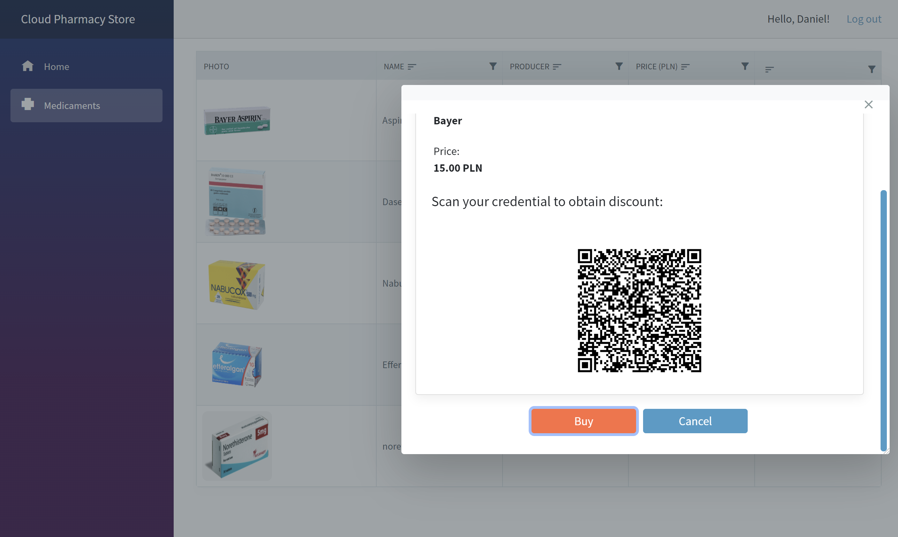

Cloud Pharmacy is a fake medical company which used Microsoft Azure cloud services to implement the system for patients, physicians, and medicaments store.

**Implementation details and architecture concepts explanation will be published on my YouTube channel in form of video series, subscribe here: [youtube.com/techmindfactory](https://www.youtube.com/techmindfactory)**

**GitHub Actions workflows can be found under [workflows](https://github.com/Daniel-Krzyczkowski/Cloud-Pharmacy-On-Azure/tree/main/.github/workflows) folder - they are disabled in this repo. I have another private repository which I use for testing and deployments**

**There is always space for improvements - feel free to create PR if you see that something can be done better!**

# Solution architecture

# Patient Web App

# Pharmacy Store Web App

# Physician Web App

# Patient's Verifiable Credential

  
